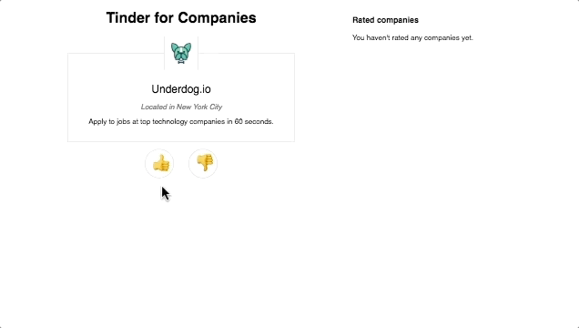

# Underdog.io Full Stack Coding Exercise

For this exercise you'll be tasked with creating a web app that will allow a job candidate
to rate companies they could potentially work at with a simple thumbs up and down rating system.

## What you'll be building

The app you'll be building is somewhat like Tinder, but for companies. Here's a GIF of the finished product in action:

The user will be shown the profile of a single company to rate, with thumbs up and down buttons that
are displayed underneath the company's profile.

When the user rates a company, the company should be added to a list in a sidebar that displays the name of each company the user has rated and the rating assigned to them, and a new company profile for the user to rate should appear in place of the company profile that is currently displayed. When there are no more companies for the user to rate, we should show the user a message letting them know they're all done.

Ratings should not persist, so if the user refreshes the page, they will lose their ratings and have to start over from scratch.
This is obviously not the ideal user experience, but it does help to make this coding exercise less complicated.

## Back-end requirements

The back-end should be an API that the front-end consumes in order to fetch and render company data. The API should be RESTful and return data in JSON format.

We've provided a JSON file that contains the data for the companies that users will be rating ([/companies.json](./companies.json)). You can load the data when your app is started and keep it in memory; using a database is not required.

The design of the API and the endpoint(s) it exposes are entirely up to you. Handling errors (like a bad request parameter or trying to fetch a company that does not exist) is not required, but it is encouraged. Using a web framework (like Flask, Express, Koa, etc.) is also strongly encouraged. Writing tests is not required.

Please write the API in either Python, Go, or JavaScript. Choose the language you are most comfortable with.

## Front-end requirements

The front-end should be a purely client rendered application, written with modern JavaScript (ES6+) and React. We've included a boilerplate development environment that makes use of [Parcel](https://parceljs.org) to handle transpiling and bundling your code, so you can focus on building the app and not have to worry about getting Webpack and Babel setup :). Navigate to the [`/front-end`](./front-end) directory of this project and run `npm run dev` in your favorite terminal to get started.

We've included some screenshots of what the interface should look like in the [/examples](./examples) directory. These screenshots are only meant to serve as examples; you don't need to completely recreate them pixel for pixel. It's okay if your app looks slightly different, as long as it's usable and works as expected.

Don't worry about creating a server for the front-end app either. We can use Parcel to serve and run the app locally. And, like for the back-end, writing tests is not required.

## How to share your work

You can either share your source code in a GitHub repo or email it to us in a ZIP file.

Be sure to include a README in your repo that includes instructions for getting the app running locally on another machine.
We'll use those instructions to run your app.
